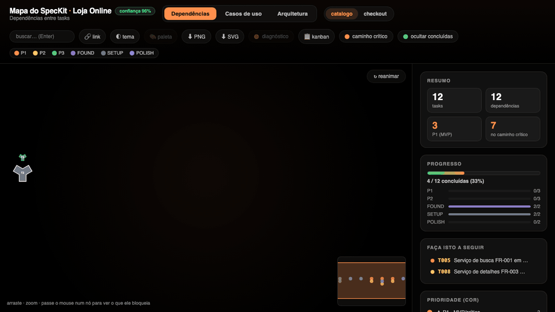
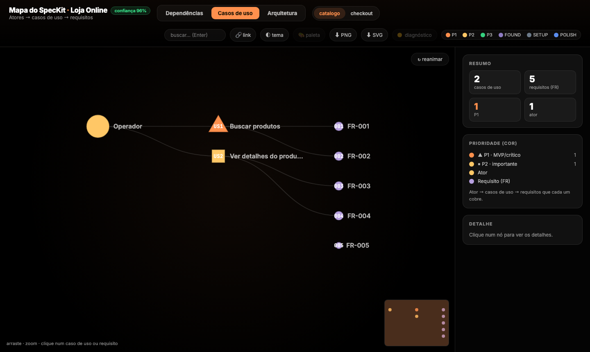
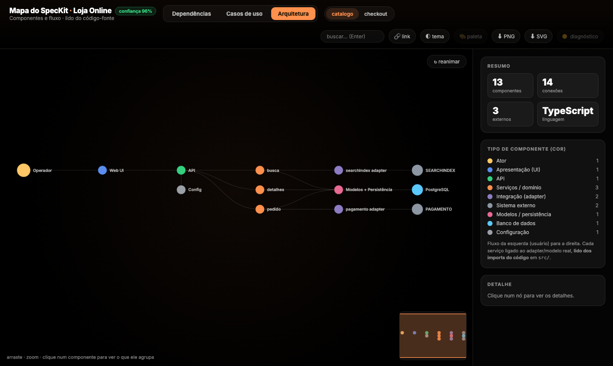
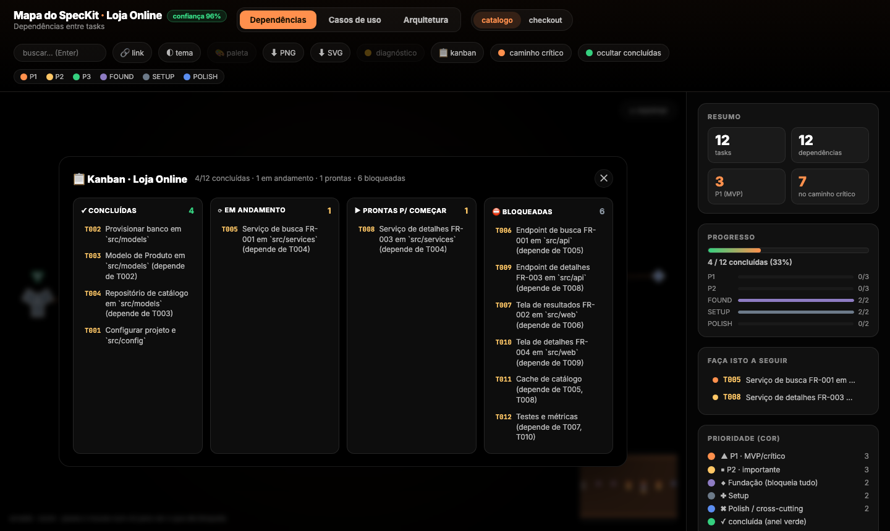
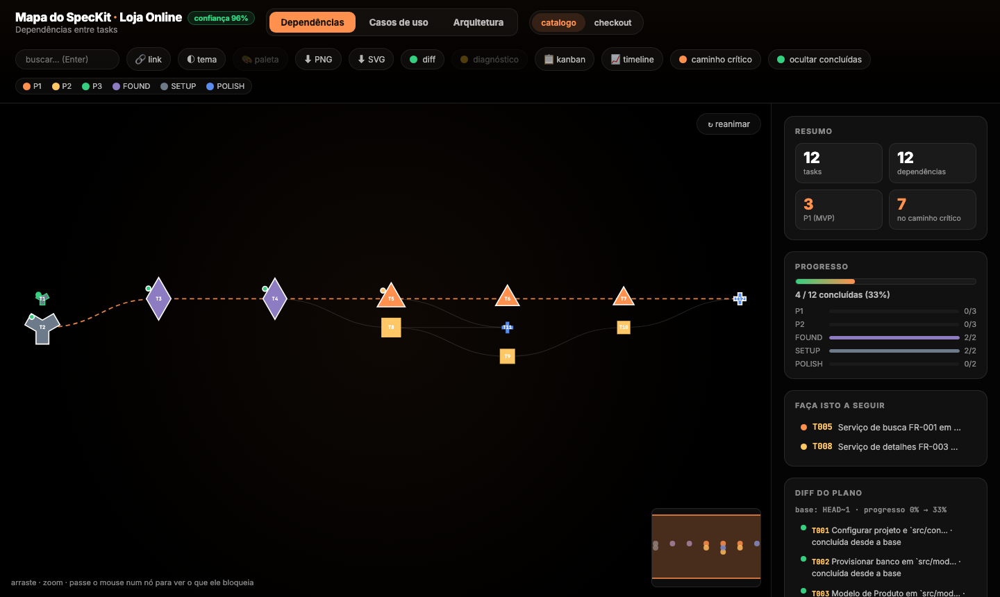
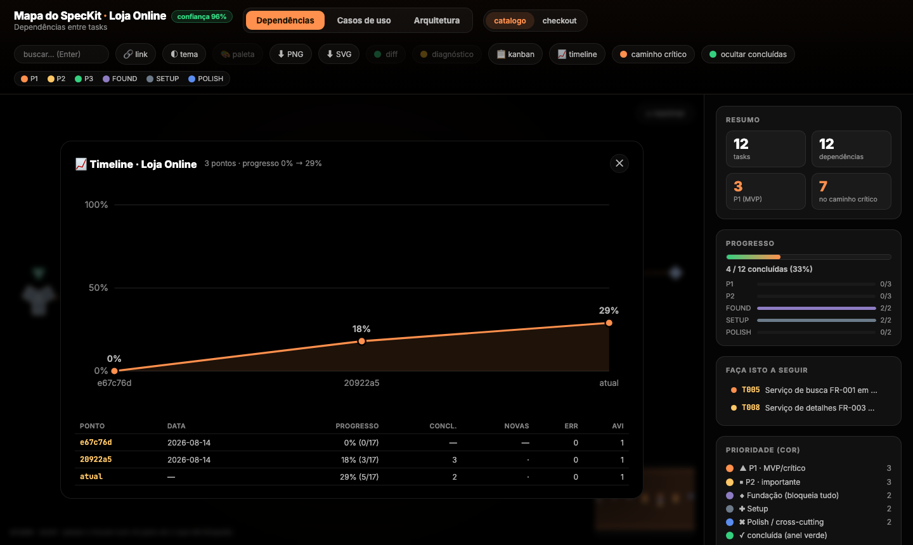

# sdd-graph

**SDD-Graph** (antes `speckit-graph`) — diagramas interativos de projetos *Spec-Driven
Development*. Lê [SpecKit](https://github.com/github/spec-kit), o pipeline forward do
[Reversa](https://github.com/sandeco/reversa) (`_reversa_forward/`) e a skill
[tlc-spec-driven](https://github.com/tech-leads-club/agent-skills) (`.specs/features/`);
detecta a fonte automaticamente (ou `--adapter <nome>`); mais adapters no roadmap (ver
[`docs/plano-sdd-graph.md`](docs/plano-sdd-graph.md)).
Lê `specs/*/` de um projeto e gera **um HTML self-contained com 3 abas**:



- **Dependências** — grafo dirigido em camadas das tasks (layout com redução de cruzamentos por barycenter; grafos grandes, a partir de 400 nós, usam **Sugiyama completo** — dummies + minimização por mediana + arestas roteadas pelas camadas): cor = prioridade (P1/P2/P3, Setup, Fundação, Polish), tamanho = quão bloqueante, **caminho crítico** animado. Barra de **progresso** (geral e por prioridade, lida dos checkboxes `- [x]`) e painel **"faça isto a seguir"** com as tasks já desbloqueadas (todas as dependências concluídas); concluídas ganham anel verde, prontas ganham anel âmbar. Botão **📋 kanban** abre um quadro read-only (derivado do plano, nunca editável) com quatro colunas — concluídas · **em andamento** (`- [~]`) · prontas p/ começar · **bloqueadas** (calculadas pelas dependências) — bom para a daily.
- **Casos de uso** — ator → casos de uso (user stories do `spec.md`, cor por prioridade) → requisitos (FR) que cada um cobre.
- **Arquitetura** — componentes e fluxo (Web UI → API → Serviços → integrações/modelos → sistemas externos e banco). Se houver código **Python, Java, TypeScript/JavaScript ou Go** em `src/`, **lê os `import`s** e liga cada serviço ao adapter/modelo real (preciso); senão, deriva das pastas + `plan.md` (heurístico). O subtítulo indica qual dos dois. Por linguagem: **Python** — absolutos (`from src.a.b`) e **relativos** (`from ..integrations.binance import ...`); **Java** — `import`s sob o pacote-base detectado; **TS/JS** — relativos (`../services/x`) e alias de raiz (`@/…`, `~/…`, `src/…`), pacotes externos (bare, ex.: `react`) ignorados; **Go** — imports que começam pelo módulo do `go.mod` (contêineres `internal/`, `pkg/`, `cmd/` são transparentes). Nomes de camada variados são normalizados (EN + **PT-BR**: service/servico, controller/controle, repository/repositorio, gateway/integracao…). **Monorepo:** use `--src <pasta-da-feature>` para escopar a varredura, senão o pacote-base fica genérico demais e a arquitetura não é reconhecida.

Comum às três: hover ilumina a cadeia, clique abre o detalhe (com **métricas**: quantas tasks dependem/desbloqueiam) e botão **🎯 focar a cadeia**, que isola só os ancestrais e descendentes daquele nó (o resto some), com auto-zoom e um chip para sair. Toggle **⚠ diagnóstico** sobrepõe no grafo os achados do Doctor por severidade (ponto vermelho = erro, âmbar = aviso, azul = info) e abre um card lateral com a lista completa, clicável para saltar ao nó. Ainda: card flutuante ao passar o mouse no nó (mesma apresentação rica do painel de clique — id, prioridade, label, fase/story, requisitos —, só sem as listas de dependências, que já ficam visíveis pelo destaque da cadeia), filtro por prioridade, toggle entre specs, **minimapa** de orientação e **busca** com contador, ‹ › e auto-zoom ao resultado (Enter). **Permalink** (estado da visão no `#hash` — inclui foco e diagnóstico —, botão "🔗 link"). **Acessibilidade:** forma do nó por prioridade (duplo canal, não só cor), paleta segura para daltonismo (Okabe-Ito), tema claro + modo de impressão, e respeito a `prefers-reduced-motion`.

Fontes lidas (somente leitura, nunca escreve): `tasks.md` (dependências), `spec.md` (casos de uso e texto dos FRs), `plan.md` (stack), e — quando existir — `src/**/*.{py,java,ts,tsx,js,jsx,go}` (acoplamento real na aba Arquitetura).

Zero dependências de runtime (Node ≥ 18). D3 embutido no HTML.

## Telas

**Casos de uso** — ator → histórias de usuário → requisitos (FR) que cada uma cobre; requisitos sem task vinculada aparecem esmaecidos.



**Arquitetura** — componentes e fluxo lidos dos `import`s do código (aqui, TypeScript): cada serviço ligado ao adapter/modelo real, até os sistemas externos e o banco.



**Kanban** — quadro read-only derivado do plano: concluídas · em andamento (`[~]`) · prontas p/ começar · bloqueadas (calculadas pelas dependências).



**Diff** — o que mudou desde uma base (git-ref ou snapshot), sobreposto no grafo (🟢 concluída · 🔵 nova · 🟡 alterada) com card lateral.



**Timeline** — evolução do progresso ao longo dos commits: gráfico + tabela por ponto.



## Uso rápido

```bash
# a partir da raiz de um projeto SpecKit (que tenha specs/*/tasks.md)
npx --yes github:CristianonCarvalho/sdd-graph --open
```

Isso gera `sdd-graph.html` na raiz do projeto e abre no navegador.

### Opções

```
sdd-graph [opções]
  --specs <dir>     diretório de specs (default: ./specs autodetectado)
  --src <dir>       pasta de código p/ a aba Arquitetura (default: <raiz>/src);
                    em monorepo, aponte só à feature (ex.: src/modulos/pedidos/consulta)
  --adapter <nome>  força o adapter SDD (default: autodetecta). Hoje: speckit, reversa, tlc
  --out <arquivo>   saída (default: ./sdd-graph.html)
  --project <nome>  nome exibido no cabeçalho
  --cdn             usa D3 via CDN (arquivo menor, precisa de internet)
  --open            abre o HTML no navegador ao terminar
  --doctor          imprime o diagnóstico do plano (ver abaixo)
```

O HTML é um **snapshot estático**: reflete os specs/código/git do momento em que foi gerado. Para atualizar o conteúdo, **regere** (dar F5 sozinho não muda os dados; mas se você regerar no mesmo `--out`, o F5 na aba já mostra a versão nova).

### Atualizar automaticamente (watch)

```bash
sdd-graph watch --src ./src --open       # regera a cada save; abre uma vez
sdd-graph watch --src ./src --diff HEAD~1  # inclui a sobreposição de diff (é barato)
```

Observa `specs/` (e `--src`, se dado) e **regera a base a cada mudança** (debounce de 200 ms) — aí é só dar F5 na aba. O `--timeline` é **ignorado** no watch de propósito (materializa N versões do git, caro a cada save); rode-o sob demanda. `Ctrl+C` para parar. Usa `fs.watch` recursivo (macOS/Windows; em Linux cai para não-recursivo no topo das pastas).

## Doctor — diagnóstico determinístico do plano

Um "linter" do plano SpecKit: roda sobre o que já é lido e aponta problemas de planejamento, de forma reproduzível (mesmo input → mesma saída), sem rede nem escrita.

```bash
sdd-graph doctor            # relatório humano
sdd-graph doctor --strict   # sai com código ≠0 se houver erro (para CI)
sdd-graph --doctor          # mesmo relatório junto do fluxo normal
```

Regras (id · severidade):

| Severidade | Regras |
|---|---|
| **Erro** | `CYCLE` (ciclo de dependência, com a aresta que quebra) · `DEP_UNKNOWN` (depende de ID inexistente) · `SELF_DEP` (depende de si mesma) · `DUP_TASK_ID` (ID repetido) |
| **Aviso** | `TASK_NO_PRIORITY` · `TASK_NO_STORY` · `FR_ORPHAN` (FR não citado por nenhuma task) · `STORY_NO_FR` (user story sem FR) |
| **Info** | `CODE_ORPHAN` (módulo em `src/` sem task que o cite — heurístico) |

O diagnóstico também é embutido no HTML (`diagnostics`) para uso futuro na sobreposição visual.

### Índice de confiança

Cada spec recebe um **índice de confiança (0–100)** — uma leitura honesta de "quanto confiar neste grafo", determinística. Aparece como badge no HTML, no `doctor` e no JSON do `check` (`confidenceIndex`). Combina 4 dimensões (peso redistribuído quando uma não se aplica):

- **task** — parsing das tasks (linhas casadas vs. malformadas)
- **dep** — resolução das dependências (válidas vs. quebradas/auto-referência)
- **arch** — derivação da arquitetura: lida do código (100%) · base ambígua (75%) · heurística (50%)
- **import** — resolução dos imports do código: absoluto exato · relativo inferido (crédito parcial) · não resolvido

Ex.: um monorepo sem `--src` cai a ~81% (arquitetura heurística); com `--src` na feature sobe a 100%.

## CI Gate — `check` (exit code + JSON)

Embrulha o Doctor para o pipeline: relatório **JSON canônico** (determinístico) e **exit code** para reprovar o merge quando o plano tem problemas.

```bash
sdd-graph check                       # JSON no stdout; exit 1 se houver erro
sdd-graph check --json report.json    # grava o JSON
sdd-graph check --gate error,warn     # também reprova em avisos
```

Exit: `0` passou · `1` reprovou · `2` erro de execução.

### Export & resumo

```bash
sdd-graph summary               # resumo Markdown no stdout (p/ PR/issue/ata)
sdd-graph --summary resumo.md   # grava em arquivo
```

O resumo (determinístico) traz progresso, caminho crítico, gargalos, próximas tasks desbloqueáveis, achados do Doctor e o índice de confiança. No HTML, os botões **⬇ PNG** e **⬇ SVG** exportam a visão atual (respeitando aba, filtros, zoom e tema) — serialização nativa, sem libs.

**Adoção gradual (baseline)** — para um plano legado que já tem problemas, aceite o estado atual e passe a reprovar só no que for **novo**:

```bash
sdd-graph check --baseline sg.baseline.json --update-baseline   # aceita o legado
git add sg.baseline.json                                        # versione
sdd-graph check --baseline sg.baseline.json                     # reprova só regressões novas
```

Cada achado tem um `fingerprint` estável (independe de ordem/posição). Workflow de exemplo do GitHub Actions em [`examples/github/sdd-graph.yml`](examples/github/sdd-graph.yml).

**Comentário de PR** — `check --format md` emite Markdown (tabela de achados com links para a visão exata) para postar como comentário fixo no PR:

```bash
sdd-graph check --format md --base-url https://ci.exemplo/sdd-graph.html
```

O Markdown traz um marcador `<!-- sdd-graph -->` para o comentário ser atualizado (não duplicado) a cada push.

## Diff / Timeline — o que mudou no plano

Compara **duas versões do plano** e resume a evolução, de forma determinística: tasks **concluídas** desde a base, **novas/removidas**, mudanças de **status** (`todo`/`doing`/`done`), **prioridade** e **dependências**, e achados do Doctor que **surgiram/sumiram** — mais o delta de progresso.

A base (`--from`) pode ser um **git ref** (comparação instantânea entre commits) ou um **snapshot salvo** (não precisa de git):

```bash
# vs. um commit — materializa os specs daquele ref via `git archive`
sdd-graph diff --from HEAD~1
sdd-graph diff --from v1.0 --src src/modulos/pedidos/consulta   # monorepo: escopa o código

# vs. um snapshot versionado (determinístico, sem git)
sdd-graph snapshot base.json     # grava o estado atual
git add base.json                # versione junto do plano
# … tempo depois …
sdd-graph diff --from base.json  # o que mudou desde então
```

Saída em **Markdown** (stdout, bom para PR/issue/ata) ou **JSON canônico** com `--json [arquivo]`; `--out <arquivo>` grava em disco. Exemplo de saída:

```
**1 concluída(s)** desde a base · 0 nova(s) · 0 removida(s) · achados: +0 / −0
#### 001-clean
Progresso: 25% → 50% (2/4, +1 concluída(s))
✅ Concluídas: T002
🔄 Status: T003 todo→doing
```

O snapshot é um JSON pequeno (status/prioridade/deps/frs das tasks, achados por `fingerprint` e progresso) — o mesmo plano gera sempre os mesmos bytes.

**Diff visual no HTML** — passe `--diff <base>` ao gerar o grafo para **sobrepor a evolução** na aba Dependências: cada nó ganha um marcador (🔵 nova · 🟢 concluída desde a base · 🟡 alterada) e um card lateral **"Diff do plano"** lista as mudanças (clicável para saltar ao nó). Toggle **🕒 diff** liga/desliga; o estado entra no permalink.

```bash
sdd-graph --diff HEAD~1 --open        # o que mudou desde o commit anterior
sdd-graph --diff base.json --open     # desde um snapshot salvo
```

**Timeline (N versões)** — acompanha a **evolução ao longo de vários commits**: progresso por ponto, concluídas/novas entre pontos, contagem de erros/avisos e uma tendência em sparkline. Determinístico (as datas vêm do git, não do relógio).

```bash
sdd-graph timeline --last 8       # últimos 8 commits que tocaram os specs + estado atual
sdd-graph timeline --refs v1.0,v1.1,HEAD
sdd-graph timeline --json tl.json # JSON canônico em vez de Markdown
```

```
Progresso: `▂▃▅▆█`  11% → 80%  (5 pontos)
| Ponto     | Data       | Progresso | Concluídas | Novas | Erros | Avisos |
| a1b2c3d   | 2026-08-10 | 40% (4/10)|     2      |   1   |   0   |   1    |
No período: 6 concluída(s) · 2 nova(s) · 0 removida(s) · achados +1 / −3
```

**Timeline visual no HTML** — passe `--timeline [N]` ao gerar para embutir a evolução (últimos N commits, default 8) num painel: botão **📈 timeline** abre um **gráfico de progresso** (área + linha, com % por ponto) e a **tabela** (progresso, concluídas, novas, erros/avisos por ponto).

```bash
sdd-graph --timeline --open        # últimos 8 commits + estado atual
sdd-graph --timeline 12 --open
```

## Comando /sdd-graph (Claude Code, GitHub Copilot e Kiro)

Instale o comando `/sdd-graph` nas três ferramentas de IA de uma vez:

```bash
npx --yes github:CristianonCarvalho/sdd-graph init
```

Isso instala, no projeto atual:

| Ferramenta | Arquivo instalado | Como invocar |
|---|---|---|
| **Claude Code** | `.claude/commands/sdd-graph.md` | `/sdd-graph` |
| **GitHub Copilot** (VS Code/JetBrains) | `.github/prompts/sdd-graph.prompt.md` | `/sdd-graph` |
| **GitHub Copilot CLI** | `.github/extensions/sdd-graph/extension.mjs` | `/sdd-graph` (direto) |
| **Kiro** | `.kiro/steering/sdd-graph.md` | `/sdd-graph` |

> **Atualizando de uma instalação antiga (`/speckit-graph`)?** `init --migrate` remove os
> arquivos com o nome antigo; `init --keep-legacy` mantém os dois nomes instalados durante
> a transição. O binário `speckit-graph` continua funcionando como alias de `sdd-graph`.

> **Copilot CLI:** o CLI não reconhece slash commands de `.github/prompts/`
> ([issue #618](https://github.com/github/copilot-cli/issues/618)). Para ter `/sdd-graph`
> **direto** (sem `/agent`), este projeto instala uma **extensão do Copilot CLI**
> (`.github/extensions/sdd-graph/extension.mjs`) que registra o slash command via
> `@github/copilot-sdk`. Requer o CLI instalado (`npm install -g @github/copilot`); rode
> `/extensions reload` se editar a extensão numa sessão aberta. As extensões são por-projeto.
>
> Alternativa: `init --target copilot-cli-agent` instala um **custom agent**
> (`.github/agents/…` ou, com `--global`, `~/.copilot/agents/`), acionado por `/agent`.

Opções:

```bash
npx --yes github:CristianonCarvalho/sdd-graph init --target kiro          # só uma
npx --yes github:CristianonCarvalho/sdd-graph init --target claude,kiro   # algumas
npx --yes github:CristianonCarvalho/sdd-graph init --target copilot-cli --global  # agente global do Copilot CLI
npx --yes github:CristianonCarvalho/sdd-graph init --global               # ~/.claude, ~/.kiro, ~/.copilot/agents
```

## Desenvolvimento local

```bash
git clone <repo> && cd sdd-graph
npm link                       # disponibiliza o binário `sdd-graph` (+ alias `speckit-graph`)
# ou aponte o comando para o checkout:
export SDD_GRAPH_HOME=/caminho/para/sdd-graph
```

## Testes

Suíte com o runner nativo do Node (`node:test`, zero dependências):

```bash
npm test          # ou: node --test test/*.test.mjs
```

Cobre o núcleo determinístico — parser (incl. imports relativos), Doctor (regras + ordenação), CI Gate (baseline, fingerprint, JSON canônico), índice de confiança, resumo e a camada de adapters SDD. Rodam em CI (Node 18/20/22) via [`.github/workflows/test.yml`](.github/workflows/test.yml).

## Como o parser entende o SpecKit

Via o adapter SpecKit (`src/adapters/speckit.mjs`) — outros adapters no roadmap, ver [`docs/plano-sdd-graph.md`](docs/plano-sdd-graph.md).

- Fases (`## Phase N: ...`) definem a user story e a prioridade (`Priority: P1`).
- Fases sem story viram `SETUP` / `FOUND` (Foundational) / `POLISH`.
- Tasks: `- [ ] T001 [P] descrição...` → `[X]` = concluída, `[~]` = em andamento, `[P]` = paralelizável.
- Dependências: `depende de T003`/`depends on T003` (PT/EN), ranges `T008–T013` e listas
  `T020, T031`, quando a task declara. **Quando não declara** (comum — a geração oficial do
  spec-kit nunca exige essa anotação), infere pela estrutura: 1ª task de cada fase (e
  qualquer task `[P]`) recebe todas as tasks da fase anterior como dependência; as demais
  encadeiam na task anterior do arquivo. Marcada como inferida na confiança (crédito
  parcial), nunca sobrescreve uma dependência declarada.
- Requisitos: qualquer `FR-XXX` citado na descrição.

Nunca escreve nos arquivos de spec — apenas lê.

## Como o parser entende o Reversa

Via o adapter Reversa (`src/adapters/reversa.mjs`) — lê o pipeline **forward**
(`_reversa_forward/<slug>/`), formato confirmado contra os templates reais do projeto.

- `actions.md`: tasks `T001…` em tabela, por fase (`## Fase N, Nome`); `Dependências` por
  vírgula; paralelismo = `` `[//]` ``; status = `` `[ ]` ``/`` `[X]` ``. Prioridade vem da
  fase (Preparação→Setup, Polimento→Polish) ou é **herdada** do MoSCoW do RF citado na
  descrição (Must→P1, Should→P2, Could→P3).
- `requirements.md`: requisitos `RF-01…` (seção "Requisitos Funcionais") e personas
  (seção "Personas e cenários de uso") viram casos de uso — sem vínculo formal a RF na
  fonte, o Doctor sinaliza isso (`STORY_NO_FR`).
- Arquitetura: heurística, a partir do "Arquivo alvo" real de cada ação.
- Detecção automática (ou `--adapter reversa`); coexiste com SpecKit no mesmo projeto —
  com mais de uma fonte, os slugs ganham prefixo (`speckit:…`, `reversa:…`).

Nunca escreve nos arquivos do Reversa — apenas lê.

## Como o parser entende o tlc-spec-driven

Via o adapter `tlc` (`src/adapters/tlc.mjs`) — lê `.specs/features/<feature>/{spec.md,
tasks.md}`, formato confirmado direto na skill (não só no README do catálogo).

- `spec.md`: user stories `P1`/`P2`/`P3` (seção "User Stories") e a tabela **Requirement
  Traceability** (`Requirement ID → Story`) viram casos de uso e requisitos.
- `tasks.md`: tasks `T1…` com `**Depends on**`, `**Requirement**` e checklist `**Done
  when**:` (`[x]` = concluído; parcialmente marcado = em andamento). Prioridade e story
  vêm do `Requirement` citado — as fases (`Foundation`, `Core Implementation`...) são só
  organizacionais aqui, ao contrário do Reversa.
- Arquitetura: heurística, a partir do campo **Where** de cada task.
- `design.md`/`context.md`/`validation.md`/`.specs/STATE.md` ainda não são lidos (ver
  `docs/plano-sdd-graph.md` B.6.2).
- Detecção automática (ou `--adapter tlc`); coexiste com SpecKit/Reversa no mesmo
  projeto — com mais de uma fonte, os slugs ganham prefixo (`speckit:…`, `tlc:…`).

Nunca escreve nos arquivos do tlc-spec-driven — apenas lê.

## Changelog

Histórico de versões em [`CHANGELOG.md`](CHANGELOG.md). Versão atual: **0.10.2**.
